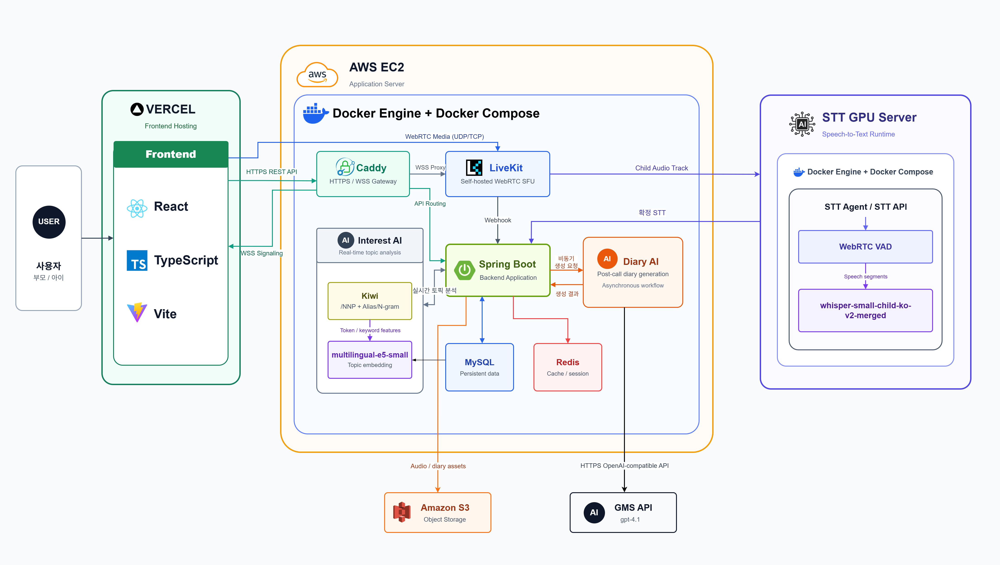
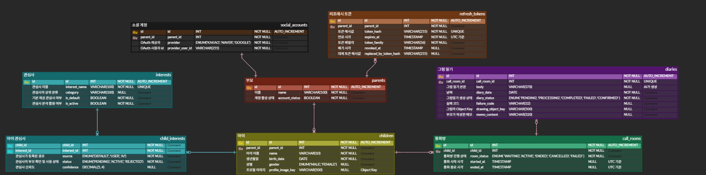

# Call Me Baby

> 부모와 아이의 일상을 연결하는 AI 기반 실시간 영상통화 서비스

  

<strong>아이의 오늘을 듣고, 이해하고, 함께 기록하는 AI 육아 동반자</strong>

---

## 📌 목차

- [Call Me Baby](#call-me-baby)
  - [📌 목차](#-목차)
  - [🍼 서비스 소개](#-서비스-소개)
  - [💡 기획 배경](#-기획-배경)
  - [📋 프로젝트 개요](#-프로젝트-개요)
  - [👥 팀원 소개](#-팀원-소개)
  - [✨ 주요 기능](#-주요-기능)
    - [👨‍👩‍👧 부모·아이 실시간 영상통화](#-부모아이-실시간-영상통화)
    - [💬 AI 대화 주제 추천](#-ai-대화-주제-추천)
    - [🎨 부모·아이 공동 그림판](#-부모아이-공동-그림판)
    - [📝 통화 후 AI 일기](#-통화-후-ai-일기)
    - [👶 아이 프로필 및 관심사 관리](#-아이-프로필-및-관심사-관리)
    - [🔐 소셜 로그인](#-소셜-로그인)
  - [🎬 시연 영상](#-시연-영상)
  - [🛠 기술 스택](#-기술-스택)
  - [🏗 시스템 아키텍처](#-시스템-아키텍처)
  - [🗄 ERD](#-erd)
  - [📡 API 명세](#-api-명세)
  - [🔬 핵심 기술 상세](#-핵심-기술-상세)
    - [실시간 통화와 AI 음성 분석 분리](#실시간-통화와-ai-음성-분석-분리)
    - [LiveKit 기반 공동 그림판](#livekit-기반-공동-그림판)
    - [실시간 관심사 파이프라인](#실시간-관심사-파이프라인)
    - [통화 후 비동기 일기 생성](#통화-후-비동기-일기-생성)
    - [인증 및 연결 보안](#인증-및-연결-보안)
  - [📚 프로젝트 산출물](#-프로젝트-산출물)
  - [📝 회고](#-회고)

## 🍼 서비스 소개

**Call Me Baby**는 부모와 아이가 안전하고 즐겁게 소통할 수 있도록 돕는 AI 기반 실시간 영상통화 서비스입니다.

영상통화 중 아이의 음성을 실시간으로 분석해 대화 주제를 파악하고, 대화를 이어갈 수 있는 질문과 반응을 제공합니다. 통화가 끝나면 AI가 대화 내용을 바탕으로 일기를 생성하고, 부모와 아이가 함께 그린 그림과 메모를 하나의 기록으로 남깁니다.

## 💡 기획 배경

영상통화는 멀리 있는 부모와 아이를 연결하지만, 대화 주제를 찾고 아이의 하루를 꾸준히 기록하는 일은 쉽지 않습니다. Call Me Baby는 대화 소재 부족, 아이의 관심사를 놓치는 문제, 통화 후 기록의 어려움, 함께할 활동 부족을 해결하는 것을 목표로 합니다.

## 📋 프로젝트 개요

| 항목 | 내용 |
| --- | --- |
| 프로젝트명 | Call Me Baby |
| 프로젝트 유형 | AI 기반 부모·아이 실시간 영상통화 서비스 |
| 개발 기간 | `2026.07.06 ~ 2026.08.10` |
| 개발 인원 | 6명 |
| 플랫폼 | Web Application |
| 배포 환경 | Vercel, AWS EC2 |

## 👥 팀원 소개

<table>
  <tr>
    <td align="center" width="33%">
       
      <strong>강현지</strong> 팀장 · AI 
      <a href="https://github.com/">@hyunjeekang</a>  
      한일1 한일2
    </td>
    <td align="center" width="33%">
       
      <strong>이어진</strong> BE · AI 
      <a href="https://github.com/">@win929</a>  
      소셜 로그인·JWT 인증 구현 LiveKit 통화 세션·Redis TTL 기반 재접속 복구 AI 그림일기 품질 평가·프롬프트 개선
    </td>
    <td align="center" width="33%">
       
      <strong>임건애</strong> Infra, BE 
      <a href="https://github.com/wo-oaw">@wo-oaw</a>  
      CI/CD·배포 인프라 통화방·그림일기 API
    </td>
  </tr>
  <tr>
    <td align="center">
       
      <strong>박규연</strong> FE 
      <a href="https://github.com/">@babagyuya</a>  
      주요 페이지 UI/UX 구현 소셜 로그인 연동
    </td>
    <td align="center">
       
      <strong>김수진</strong> FE 
      <a href="https://github.com/soo83705-ui">@soo83705-ui</a>  
      FE 영상통화 FE 동물필터 성능 개선 
    </td>
    <td align="center">
       
      <strong>오현민</strong> FE 
      <a href="https://github.com/">@github-id</a>  
      WebRTC·MediaPipe 기반 실시간 미디어 기능 구현 UI/UX 설계
    </td>
  </tr>
</table>

## ✨ 주요 기능

### 👨‍👩‍👧 부모·아이 실시간 영상통화

> 부모와 아이가 하나의 통화방에 입장해 영상과 음성으로 실시간 소통할 수 있습니다. 통화방 생성부터 입장, 재접속, 종료까지의 상태를 안정적으로 관리합니다.

| 통화 화면 | 통화 흐름 GIF |
| --- | --- |
| `[화면 추가 예정]` | `[GIF 추가 예정]` |

### 💬 AI 대화 주제 추천

> 아이의 음성을 실시간으로 분석해 관심사를 파악하고, 부모가 자연스럽게 대화를 이어갈 수 있도록 맞춤형 질문과 대화 소재를 제공합니다.

| 대화 주제 추천 화면 | AI 분석 GIF |
| --- | --- |
| `[화면 추가 예정]` | `[GIF 추가 예정]` |

### 🎨 부모·아이 공동 그림판

> 영상통화 중 부모와 아이가 하나의 캔버스에서 함께 그림을 그립니다. 실시간으로 전달된 그림을 통화 후 기록에 저장해 대화의 추억으로 남길 수 있습니다.

| 공동 그림판 화면 | 그림판 동작 GIF |
| --- | --- |
| `[화면 추가 예정]` | `[GIF 추가 예정]` |

### 📝 통화 후 AI 일기

> 통화 내용을 바탕으로 아이가 들려준 이야기와 부모가 관찰한 모습을 요약해 일기로 생성합니다. 부모 메모와 공동 그림을 함께 확인하고 기록할 수 있습니다.

| AI 일기 화면 | 일기 생성 GIF |
| --- | --- |
| `[화면 추가 예정]` | `[GIF 추가 예정]` |

### 👶 아이 프로필 및 관심사 관리

> 아이의 프로필과 관심사를 등록하고, 통화 기록과 AI 분석 결과를 아이별로 관리할 수 있습니다.

| 아이 프로필 화면 | 관심사 관리 GIF |
| --- | --- |
| `[화면 추가 예정]` | `[GIF 추가 예정]` |

### 🔐 소셜 로그인

> 카카오·네이버·구글 OAuth를 이용해 간편하게 로그인하고, Access Token과 Refresh Token 기반으로 세션을 안전하게 관리합니다.

| 로그인 화면 | 로그인 GIF |
| --- | --- |
| `[화면 추가 예정]` | `[GIF 추가 예정]` |

## 🎬 시연 영상

> 전체 서비스 흐름 영상과 기능별 GIF는 추후 추가 예정입니다.

| 구분 | 자료 |
| --- | --- |
| 전체 시연 영상 | `[YouTube 또는 Google Drive 링크 추가 예정]` |
| 로그인 및 아이 등록 | `[GIF 추가 예정]` |
| 통화방 생성 및 입장 | `[GIF 추가 예정]` |
| AI 대화 주제 추천 | `[GIF 추가 예정]` |
| 공동 그림판 | `[GIF 추가 예정]` |
| 통화 후 AI 일기 | `[GIF 추가 예정]` |

## 🛠 기술 스택

| 분류 | 기술 |
| --- | --- |
| **Frontend** |    |
| **Backend** |     |
| **Database** |    |
| **AI** |      |
| **Realtime** |    |
| **Infrastructure** |     |
| **Storage & Tools** |    |

## 🏗 시스템 아키텍처

- **Frontend**: React + TypeScript + Vite, Vercel 배포
- **Application Server**: AWS EC2 Docker Compose 환경의 Caddy, LiveKit, Spring Boot, MySQL, Redis
- **Real-time Media**: LiveKit Self-hosted SFU를 통한 WebRTC 전달
- **STT Server**: GPU 서버의 WebRTC VAD + Whisper 모델
- **AI Pipeline**: Kiwi + multilingual-e5-small 관심사 분석, GMS API 일기 생성
- **Object Storage**: Amazon S3 음성·그림 저장

## 🗄 ERD

| 도메인 | 주요 테이블 | 설명 |
| --- | --- | --- |
| 인증 | `social_accounts`, `refresh_tokens` | 소셜 계정과 토큰 |
| 사용자 | `parents`, `children` | 부모 계정과 아이 프로필 |
| 관심사 | `interests`, `child_interests` | 관심사 마스터와 분석 결과 |
| 통화 | `call_rooms` | 통화방 상태·시작·종료 |
| 기록 | `diaries` | AI 일기·부모 메모·그림 |

## 📡 API 명세

- [REST API OpenAPI](../docs/api/openapi.yaml)
- [API 안내](../docs/api/README.md)
- [실시간 통신 계약](../docs/realtime/REALTIME_CONTRACT.md)
- [내부 AI API](../docs/api/ai-internal-openapi.yaml)
- [내부 Realtime API](../docs/api/realtime-internal-openapi.yaml)
- [Postman 테스트 문서](../docs/postman/README.md)

| 영역 | 대표 기능 |
| --- | --- |
| 인증 | OAuth 로그인, 토큰 재발급, 로그아웃 |
| 아이 | 아이 등록·조회·수정·삭제 |
| 관심사 | 관심사 및 아이 관심사 조회 |
| 통화방 | 생성, 입장 토큰, 상태 조회·종료 |
| 일기 | 목록·상세 조회, AI 일기 재생성 |

## 🔬 핵심 기술 상세

### 실시간 통화와 AI 음성 분석 분리

LiveKit을 미디어 전달 계층으로 사용하고 STT Agent는 아이의 microphone track만 선택 구독하도록 구성했습니다. 통화 품질과 AI 분석 처리를 분리해 통화 흐름에 미치는 영향을 줄였습니다.

### LiveKit 기반 공동 그림판

그림판 이벤트는 별도 WebSocket 대신 통화방에 이미 연결된 LiveKit Data Packet으로 전달합니다. 통화 세션과 동일한 권한 체계에서 부모·아이의 캔버스 이벤트를 처리합니다.

### 실시간 관심사 파이프라인

STT 결과에 Kiwi 키워드 추출과 multilingual-e5-small 임베딩을 조합해 관심사 후보를 계산합니다. 키워드 일치와 의미 유사도를 함께 사용해 표현이 달라도 관련 관심사를 찾습니다.

### 통화 후 비동기 일기 생성

통화 종료와 일기 생성을 분리해 종료 응답을 지연시키지 않습니다. 처리 상태와 실패 원인을 저장해 재생성·장애 추적이 가능하도록 했습니다.

### 인증 및 연결 보안

- Refresh Token은 해시값과 회전·폐기 상태 관리
- LiveKit 토큰에 방 단위 참가 권한과 publish/subscribe 권한 부여
- Caddy를 통한 HTTPS/WSS 통합 라우팅
- 운영 로그에 STT 원문·사용자 이름·토큰 등 민감 정보 미기록

## 📚 프로젝트 산출물

| 산출물 | 링크 |
| --- | --- |
| 요구사항 명세서 | `[링크 추가 예정]` |
| 화면 설계서 | `[링크 추가 예정]` |
| API 명세서 | [OpenAPI](../docs/api/openapi.yaml) |
| ERD | [이미지](../docs/assets/erd.png) |
| 시스템 아키텍처 | [이미지](../docs/assets/system-architecture.png) |
| 시연 시나리오 | [문서](../docs/demo-stt-interest-drawing-scenario.md) |

## 📝 회고

- 잘한 점: `[팀 회고 추가 예정]`
- 아쉬웠던 점: `[팀 회고 추가 예정]`
- 배운 점과 개선 방향: `[팀 회고 추가 예정]`
